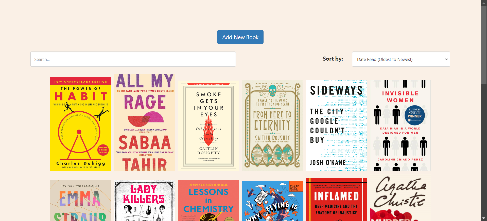
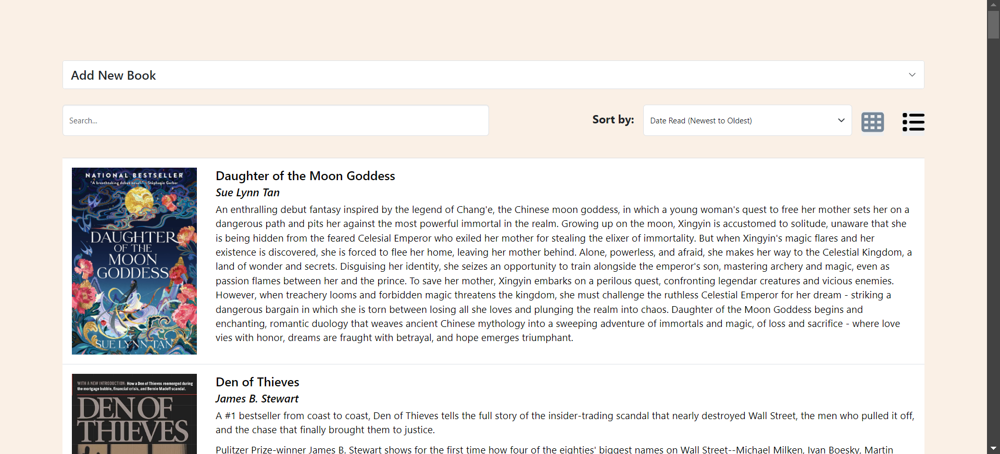
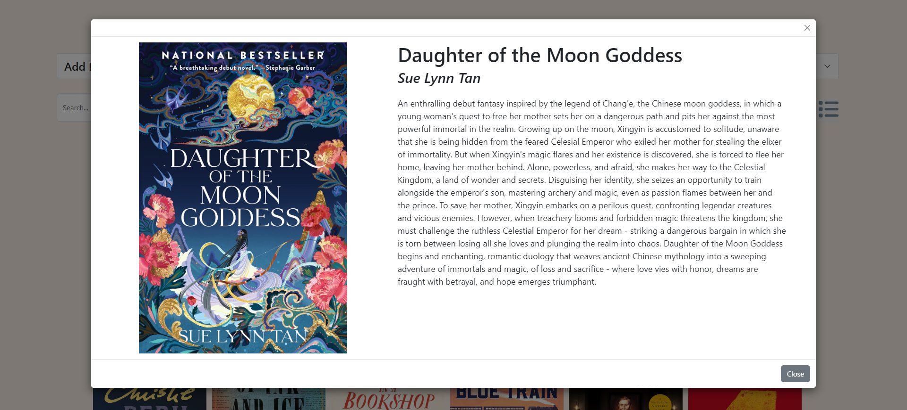
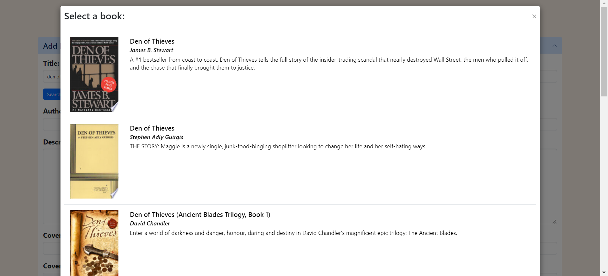
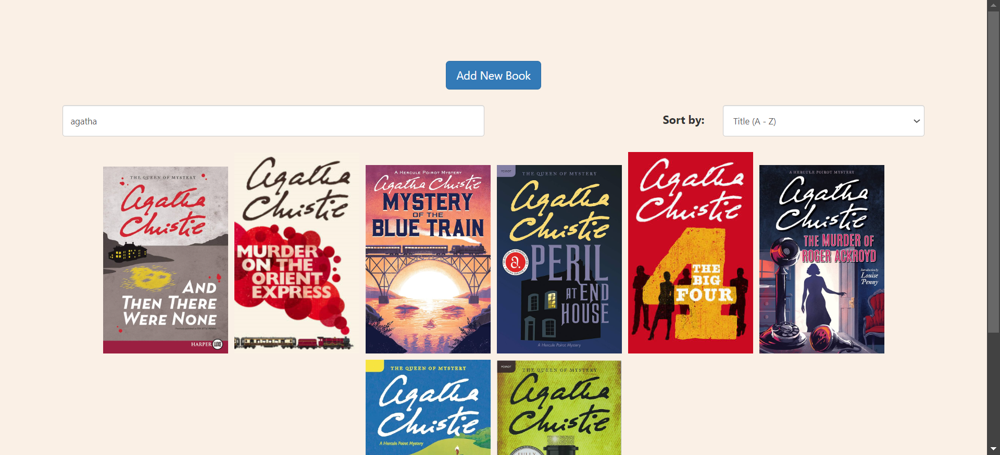
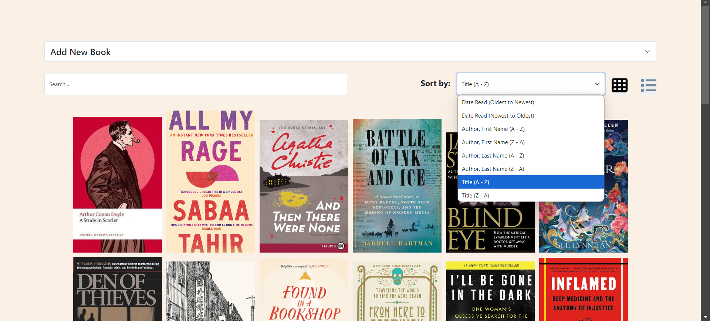

# Book Gallery

## About the Project


*Project Screenshot*

This project is a web-based collage of books I've read. 

There are two different view modes, gallery view and list view. In gallery view, only the book covers are shown - more details are shown in a separate modal. In list view, book covers are shown along with additional details beside it.


*List View*

A modal is displayed when a book is clicked on, providing more details about the book - a larger image of the cover, the title, the author(s), and a description.


*Book Modal*

New books can be added directly on the web interface. Data can either be manually added, or can be pulled from the Google Books API through a search on the title. Clicking the "Search" button performs an API call to search for books based on what is entered in the "Title" field. A modal is then shown, displaying a list of books retrieved from the API. Clicking on a book will populate the form fields with the data for the selected book. 


*Form Panel*


*Modal of Retrieved Books*

A search filter allows for filtering on author and title. Sorting is also available based on date read, author name, and title.


*Searching*


*Sorting*

Data is stored in a Microsoft Excel document. 

## Built With


## Getting Started

### Prerequisites

+ Node.js
+ NPM

### Installation

1. Clone the project using 
```
git clone https://github.com/alicia4550/book-gallery.git
```

2. Navigate to the project's root directory.

3. Run the `install.bat` file.

4. Create an API key using the following instructions: [Using the Google Books API](https://developers.google.com/books/docs/v1/using).

5. Navigate to the `client` directory.

6. Create a file `api.js` and insert the following line, inserting the API key in the quotes:
```
export const apiKey = "{INSERT API KEY HERE}";
```

### Usage

1. Navigate to the project's root directory.

2. Run the `run.bat` file.

3. Open `http://localhost:3000/` in your local browser.

## License

Distributed under the MIT License. See `LICENSE` for more information.