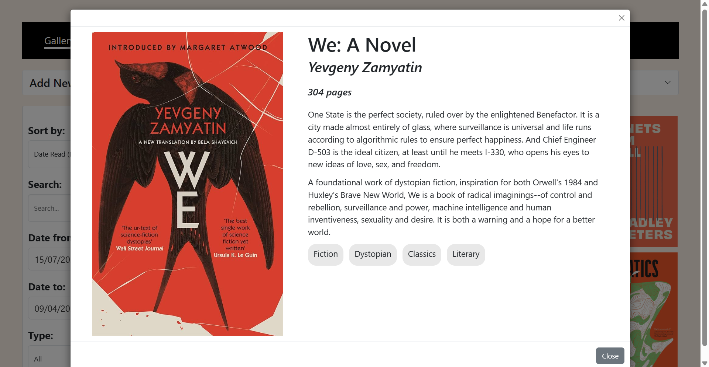
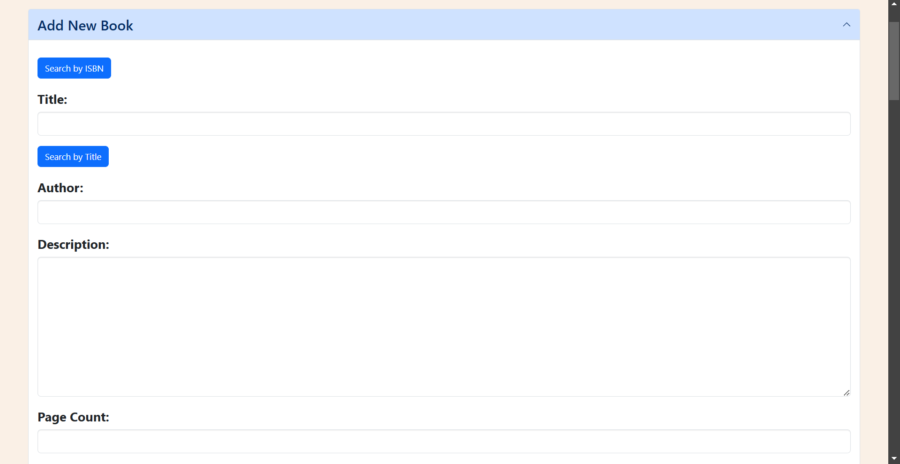
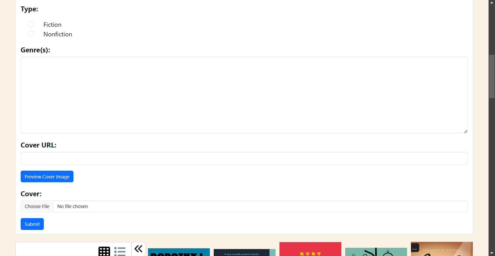
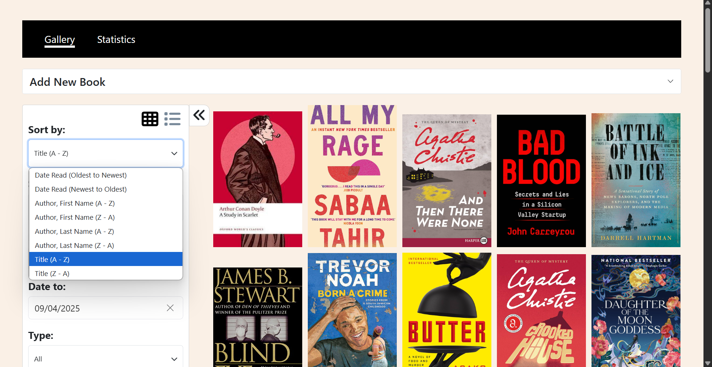

# Book Gallery

## About the Project


*Project Screenshot*

This project is a web-based collage of books I've read. It was created using the MERN stack.

There are two different view modes, gallery view and list view. In gallery view, only the book covers are shown - more details are shown in a separate modal. In list view, book covers are shown along with additional details beside it.


*List View*

A modal is displayed when a book is clicked on, providing more details about the book - a larger image of the cover, the title, the author(s), page count, description, and a list of genres.


*Book Modal*

New books can be added directly on the web interface. Data can either be manually added, or can be pulled from the Google Books API. 



*Form Panel*

Clicking the "Search by Title" button performs an API call to search for books based on what is entered in the "Title" field. A modal is then shown, displaying a list of books retrieved from the API. Clicking on a book will populate the form fields with the data for the selected book. 


*Modal of Retrieved Books*

Clicking the "Search by ISBN" button opens a modal where there is the option to either scan the ISBN barcode from the book using a camera (can choose between any connected video capturing device) or manually enter the ISBN, allowing for easy retrieval of the correct edition of the book. Once the scanner finds and decodes the barcode, an API call is immediately made to the Google Books API to find the book by the ISBN. If the ISBN is manually entered, the call is made when the "Search by ISBN" button in the modal is clicked.


*ISBN Search Modal - Live Video Input*


*ISBN Search Modal - Manual Input*


*Book Retrieved by ISBN Search*

A search filter allows for filtering on author and title. The ability to filtering by type (fiction, nonfiction, etc.) and by genre is also present. Sorting is also available based on date read, author name, and title.


*Searching by author and/or title*


*Filtering by type*


*Filtering by genre*


*Sorting*

The sorting and filtering functionality is encapsulated in a collapsible sidebar, which can be closed to allow for more books to be shown on a single line.


*Collapsed Sidebar*

In addition, there is a page that displays numerous statistics, both in terms of the total and the year to date values. Measured statistics include books read, pages read, top authors, percentage of fiction and nonfiction books read, and top genres.


*Statistics* 

## Built With


## Getting Started

### Prerequisites

+ Node.js
+ NPM

### Installation

1. Clone the project using 
```
git clone https://github.com/alicia4550/book-gallery.git
```

2. Navigate to the project's root directory.

3. Run the `install.bat` file.

4. Create an API key using the following instructions: [Using the Google Books API](https://developers.google.com/books/docs/v1/using).

5. Navigate to the `client` directory.

6. Create a file `api.js` and insert the following line, inserting the API key in the quotes:
```
export const apiKey = "{INSERT API KEY HERE}";
```

7. Set up a MongoDB database `gallery` with the collection `books`.

8. Replace the URI string on line 6 of `db.js` with the MongoDB deployment's connection string.

9. Navigate to the `server` directory.

10. Create a file `config.js` and insert the following lines:
```
const DB_PASSWORD = "{INSERT DATABASE PASSWORD HERE}";

module.exports = {
    DB_PASSWORD
}
```

### Usage

1. Navigate to the project's root directory.

2. Run the `run.bat` file.

3. Open `http://localhost:3000/` in your local browser.

## License

Distributed under the MIT License. See `LICENSE` for more information.